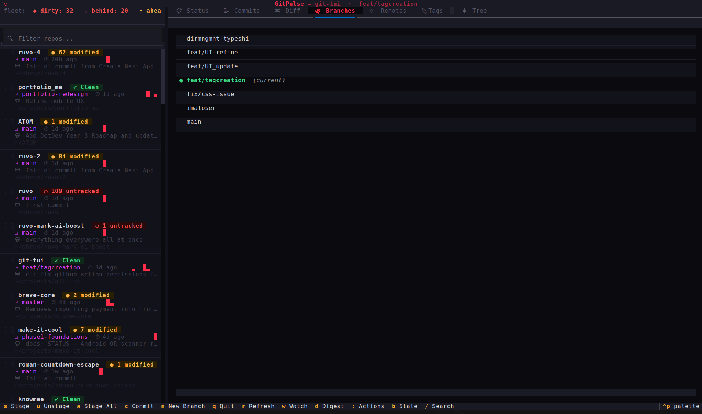
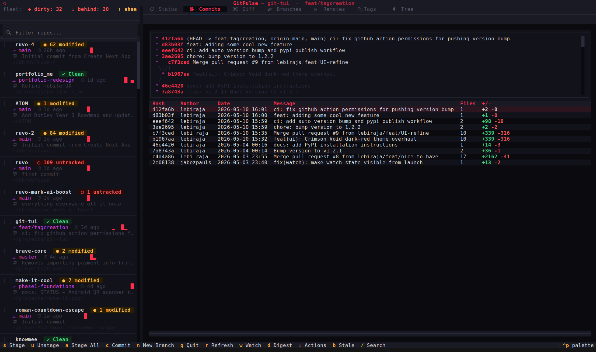

# ⚡ GitPulse — Git Repo Dashboard TUI

A developer-focused terminal dashboard that scans a root directory for all local Git repositories and displays live status, recent commits, diffs, and branch management — all from the terminal.

Built with **Python**, **Textual**, **Rich**, and **GitPython**.

## Screenshots

**📋 Status tab** — repo summary panel, staged/unstaged/untracked file lists, stash entries



**📝 Commits tab** — last N commits with color-coded insertions/deletions



## Installation

The easiest way to install GitPulse is via PyPI using `pip` or `pipx`:

```bash
pip install gitpulse-tui
```
*(We recommend using `pipx install gitpulse-tui` to install it in an isolated environment)*

### Install from source

If you prefer to install from source or want to contribute to the project:

```bash
git clone https://github.com/lebiraja/git-tui.git
cd git-tui
./install.sh
```

The installer:
- Checks your Python version (3.10+ required)
- Creates a virtual environment automatically
- Installs all dependencies
- Adds the `gitpulse` command to your shell (`~/.zshrc` / `~/.bashrc`)

Then reload your shell:
```bash
source ~/.zshrc   # or source ~/.bashrc
```

## Usage

```bash
gitpulse                          # scans current directory (or scan.roots from config)
gitpulse --root /path/to/repos   # scans a custom directory
gitpulse --root .                 # scans current directory explicitly
gitpulse --commits 20            # show 20 commits per repo (default: 10)
gitpulse --version               # print version
```

## Features

- **Sorted by Activity** — Repos ordered by most recent commit date
- **Status Badges** — Color-coded with file counts: 🟢 CLEAN / 🟡 MODIFIED (3) / 🔴 UNTRACKED (2)
- **Activity Sparkline** — 7-week commit frequency bar (`▁▂▃▅▇`) next to each repo
- **Relative Time** — "2h ago", "3d ago" shown next to each repo
- **Search/Filter** — Press `/` to filter repos by name instantly
- **Non-blocking scan** — Background worker keeps the UI responsive while scanning
- **Tabbed Main Panel**:
  - **📋 Status** — Styled repo summary panel, staged/unstaged/untracked files with icons, stash list
  - **📝 Commits** — Last N commits with color-coded `+green` / `-red` diff stats
  - **🔀 Diff** — Syntax-highlighted uncommitted changes with line count footer
  - **🌿 Branches** — All local branches, press Enter to switch
  - **🌐 Remotes** — Remote URLs with ahead/behind sync status
  - **🏷️ Tags** — Recent tags with date and tagger info
  - **🌲 Tree** — Visual file hierarchy of all tracked files

## Keybindings

| Key | Action |
|-----|--------|
| `↑` / `↓` | Navigate repo list |
| `/` | Focus search/filter |
| `Escape` | Clear search |
| `Tab` / `Shift+Tab` | Next/previous focus area |
| `Enter` | Switch branch (Branches tab) |
| `r` | Refresh / rescan all repos |
| `q` | Quit |

## Requirements

- Python 3.10+
- Linux / macOS

## Documentation

See [docs/](./gitpulse/docs/) for full developer documentation:
- [Architecture](./gitpulse/docs/architecture.md)
- [API Reference](./gitpulse/docs/api_reference.md)
- [UI Components](./gitpulse/docs/ui_components.md)
- [Theming](./gitpulse/docs/theming.md)
- [Contributing](./gitpulse/docs/contributing.md)
